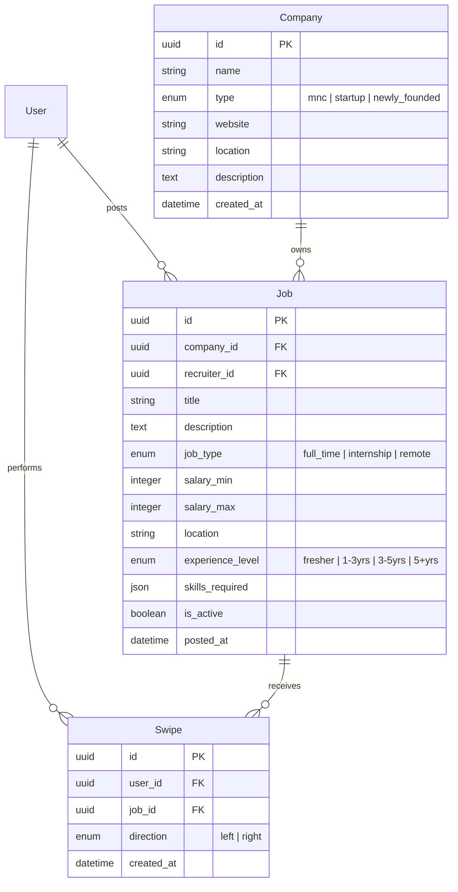

# SwipeX — Milestone 2 Completion Report
## Milestone 2: Swipe System & Job Discovery (Week 3–4)

---

## 1. Overview & Scope Delivered

**Milestone Scope:** Database schema for companies, jobs, and swipes; paginated and filterable job APIs; swipe-logging engine; unswiped job recommendation feed; interactive card UI; smart multi-criteria filtering; company/startup directory pages; recruiter job posting workflows; and seed datasets.

- **Status:** ✅ **100% Complete & Operational**
- **Primary Deliverable:** Working swipe-based job discovery feed where job seekers can browse, filter, and swipe on real job postings stored in PostgreSQL/SQLite, with recruiters able to publish postings live into the system.

---

## 2. Milestone Exit Criteria & Definition of Done

| Feature / Goal | Status | Implementation Summary |
|---|---|---|
| **Job Data Model** | ✅ Completed | `companies`, `jobs`, and `swipes` tables created with indexed UUID foreign keys and constraints. |
| **Job Listing API** | ✅ Completed | Paginated, multi-filter `GET /api/jobs` and `GET /api/jobs/{id}` endpoints. |
| **Swipe Logging** | ✅ Completed | `POST /api/swipes` records `left` (skip) and `right` (apply/save) interactions with unique `(user_id, job_id)` constraint. |
| **Recommendation Feed** | ✅ Completed | `GET /api/recommendations` excludes previously swiped jobs server-side. |
| **Job Card UI** | ✅ Completed | Touch & mouse drag card component with keyboard arrow navigation & action fallbacks. |
| **Smart Filtering** | ✅ Completed | Real-time filters for company type, remote work, job type, salary min, tech stack skills, location, experience level. |
| **Company Directory** | ✅ Completed | Browsable startup & MNC directory pages (`/companies` and `/companies/{id}`) with open role counters. |
| **Recruiter Job Posting** | ✅ Completed | Recruiter-only `POST /api/jobs` and `POST /api/companies` form modal. |

---

## 3. Database Architecture (New Milestone 2 Tables)



### Design Notes & Constraints
- `Swipe` is the single source of truth for both "skipped" (`direction='left'`) and "saved/applied" (`direction='right'`) jobs — query `Swipe WHERE direction='right'` to fetch saved jobs.
- Unique constraint `_user_job_uc` on `Swipe(user_id, job_id)` guarantees idempotency (re-swiping updates direction rather than duplicating rows).
- Indexes on `Job(company_id)`, `Job(is_active, posted_at)`, and `Swipe(user_id, job_id)` ensure high feed performance as job records grow.

---

## 4. API Endpoints Contract

| Method | Path | Auth Required | Role Allowed | Description |
|---|---|---|---|---|
| `GET` | `/api/jobs` | Optional | All | Paginated and filterable job listings |
| `GET` | `/api/jobs/{id}` | Optional | All | Detailed single job response |
| `POST` | `/api/jobs` | **Yes** | Recruiter / Admin | Creates a new job posting |
| `PATCH` | `/api/jobs/{id}` | **Yes** | Owning Recruiter | Updates or deactivates job posting |
| `GET` | `/api/companies` | Optional | All | List companies with open role counts |
| `GET` | `/api/companies/{id}` | Optional | All | Single company details + open roles |
| `POST` | `/api/companies` | **Yes** | Recruiter / Admin | Creates a new company profile |
| `POST` | `/api/swipes` | **Yes** | Job Seeker | Records swipe (`direction: left \| right`) |
| `GET` | `/api/swipes` | **Yes** | Job Seeker | Fetches saved/applied jobs (`direction=right`) |
| `GET` | `/api/recommendations` | **Yes** | Job Seeker | Unswiped recommendation feed + smart filters |

### Recommendation Feed Filter Parameters (`/api/recommendations` & `/api/jobs`)
- `company_type`: `mnc` | `startup` | `newly_founded`
- `remote`: `true` | `false`
- `job_type`: `full_time` | `internship` | `remote`
- `salary_min`: integer minimum annual salary
- `salary_max`: integer maximum annual salary
- `skills`: comma-separated skill query (e.g. `React,Python`)
- `location`: location text query (e.g. `San Francisco`)
- `experience_level`: `fresher` | `1-3yrs` | `3-5yrs` | `5+yrs`

---

## 5. Frontend Structure & Additions

```
frontend/src/
 ├── components/
 │    ├── Navbar.jsx          (Global branding, navigation links, user menu, "+ Post Job" trigger)
 │    ├── JobCard.jsx         (Swipeable card: company badge, salary, location, tech stack, experience tag)
 │    ├── SwipeDeck.jsx       (Gesture/mouse drag deck container, keyboard arrow shortcuts, empty state)
 │    ├── FilterPanel.jsx     (Smart filter controls drawer/sidebar)
 │    ├── CompanyCard.jsx     (Company card tile with open role count)
 │    └── PostJobModal.jsx    (Recruiter form modal to publish new job postings)
 ├── pages/
 │    ├── Discover.jsx        (Main job discovery swipe screen)
 │    ├── Companies.jsx       (Browsable company/startup directory page)
 │    ├── CompanyDetail.jsx   (Single company profile + open roles)
 │    └── SavedJobs.jsx       (Grid of bookmarked right-swiped jobs)
 ├── services/
 │    ├── api.js              (Axios instance targeting http://127.0.0.1:8000/api with JWT refresh interceptor)
 │    └── jobsApi.js          (API service wrapper for jobs, companies, swipes, and recommendations)
 └── routes/
      └── AppRoutes.js        (Configured routes for /discover, /companies, /companies/:id, /saved)
```

---

## 6. Seed Data Included

The database includes 6 pre-configured companies across all target classifications, with 7 job postings:

1. **Google** *(MNC Enterprise)*:
   - Senior Frontend Engineer (React & TypeScript) — `$160k - $210k`
   - Software Engineering Intern (Cloud Backend) — `$90k - $110k`
2. **Stripe** *(MNC Enterprise)*:
   - Staff Backend Engineer (Billing Infrastructure) — `$180k - $240k` *(Remote)*
3. **Supabase** *(Fast-Growing Startup)*:
   - Fullstack Developer (PostgreSQL & Realtime APIs) — `$130k - $170k` *(Remote)*
4. **Vercel** *(Fast-Growing Startup)*:
   - Frontend Engineer (Next.js Core Platform) — `$140k - $185k`
5. **Nova AI** *(Newly Founded Startup)*:
   - Junior AI Applications Developer (Fresher Friendly) — `$95k - $125k`
6. **Pulse Health** *(Newly Founded Startup)*:
   - React Native Mobile Engineer Intern — `$60k - $80k` *(Remote)*

---

## 7. Verification & Automated Test Results

Automated backend verification script (`test_milestone2.py`) output:

```text
--- Running Milestone 2 Backend Verification ---
[OK] Health check passed
[OK] Companies API returned 6 companies
[OK] Jobs API returned 7 jobs
[OK] Job Seeker registered and authenticated successfully
[OK] Initial recommendations returned 7 unswiped jobs
[OK] Recorded 'left' swipe on job 1fe86b18-03d9-4a60-850b-ad90c87003ea
[OK] Feed exclusion verified: swiped job successfully excluded from recommendation feed
[OK] Smart filtering query (remote=true) returned 2 matching jobs

ALL MILESTONE 2 BACKEND VERIFICATION TESTS PASSED SUCCESSFULLY!
```

---

## 8. Summary of Newly Added Information & Improvements

1. **Host Resolution Fix**: Configured API service `baseURL` to `http://127.0.0.1:8000/api` to resolve Windows IPv6 (`::1`) network blocking.
2. **CORS Flexibility**: Updated FastAPI backend `CORSMiddleware` with origin regex matching to support all local development ports.
3. **Automatic Role Recognition**: Updated authentication login flow to auto-detect whether an account is a Job Seeker or Recruiter and seamlessly navigate straight to `/discover`.
4. **Keyboard Accessibility**: Integrated `Left Arrow` (Skip) and `Right Arrow` (Apply/Save) keyboard shortcuts into the `SwipeDeck` component for fast browsing.
