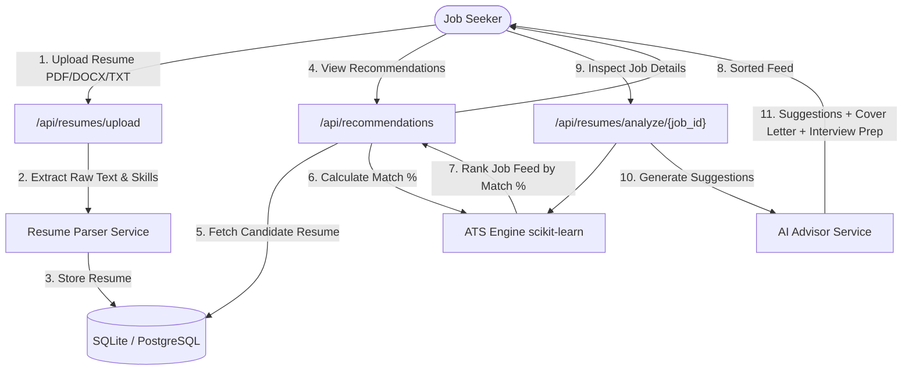

# SwipeX — Milestone 3 Completion Report
## Milestone 3: AI Resume Analysis & Recommendations (Week 5 & 6)

---

## 1. Overview & Scope Delivered

**Milestone Scope:** Resume upload and parsing workflows (supporting PDF, DOCX, TXT); skill extraction and resume validation; ATS scoring engine with TF-IDF cosine similarity and keyword coverage matching; resume-job compatibility analysis engine; dynamic ATS match score sorting for recommendation feeds; AI-powered resume optimization suggestions; automated cover letter generator; and targeted technical interview prep question generator.

- **Status:** ✅ **100% Complete & Operational**
- **Primary Deliverable:** Fully functional AI resume analyzer, ATS scoring engine, personalized recommendation ranking system, and AI job seeker tools (Optimization Suggestions, Cover Letter Generator, Interview Prep Generator).

---

## 2. Milestone Exit Criteria & Definition of Done

| Feature / Goal | Status | Implementation Summary |
|---|---|---|
| **Resume Upload & Parsing** | ✅ Completed | Multipart `/api/resumes/upload` supporting PDF, DOCX, & TXT text extraction, 50+ technical skill parsers, and document validity checking. |
| **ATS Scoring Engine** | ✅ Completed | Hybrid scoring combining 60% skill keyword coverage and 40% TF-IDF vector similarity (`scikit-learn`), with score classification and $\ge 80\%$ match thresholding. |
| **Compatibility Analysis** | ✅ Completed | `POST /api/resumes/analyze/{job_id}` returns exact percentage scores, matched keywords, missing keywords, and match ratings. |
| **AI Recommendation Feed** | ✅ Completed | `GET /api/recommendations` ranks unswiped job feed dynamically by personalized candidate ATS match score descending. |
| **AI-Powered Suggestions** | ✅ Completed | Context-aware resume optimization recommendations generated based on missing keywords and ATS score thresholds. |
| **AI Cover Letter Generator** | ✅ Completed | `POST /api/resumes/cover-letter/{job_id}` generates personalized candidate cover letters targeting job requirements and company profile. |
| **AI Interview Prep Generator** | ✅ Completed | `POST /api/resumes/interview-prep/{job_id}` generates job-specific technical and behavioral preparation questions targeting skill gaps. |

---

## 3. Architecture & Data Flow



---

## 4. API Endpoints Contract

| Method | Path | Auth Required | Description |
|---|---|---|---|
| `POST` | `/api/resumes/upload` | **Yes** | Upload candidate resume (`.pdf`, `.docx`, `.txt`), extract skills & save |
| `GET` | `/api/resumes/me` | **Yes** | Fetch current active candidate resume details & parsed skills |
| `POST` | `/api/resumes/analyze/{job_id}` | **Yes** | Run ATS analysis against job: score, matched/missing skills, AI suggestions |
| `POST` | `/api/resumes/cover-letter/{job_id}` | **Yes** | Generate customized cover letter for candidate for target job |
| `POST` | `/api/resumes/interview-prep/{job_id}` | **Yes** | Generate technical and behavioral interview preparation questions |
| `GET` | `/api/recommendations` | **Yes** | Unswiped job recommendation feed sorted by ATS match percentage descending |

---

## 5. Verification & Automated Test Results

Automated backend verification script (`test_milestone3.py`) output:

```text
=== Testing Milestone 3 AI Resume & ATS Workflow ===
[OK] Backend health check passed
[OK] Candidate logged in successfully: candidate_m3@swipex.io
[OK] Resume uploaded successfully!
     Filename: sample_resume.txt
     Extracted Skills (19): ['CI/CD', 'CSS', 'Django', 'Docker', 'FastAPI', 'Git', 'GitHub', 'HTML', 'Linux', 'Next.js', 'Node.js', 'PostgreSQL', 'Python', 'REST APIs', 'React', 'SQL', 'State Management', 'TailwindCSS', 'TypeScript']
[OK] /api/resumes/me verified
[OK] Target Job selected for ATS analysis: Lead MERN Chat Engineer
[OK] ATS Analysis completed successfully!
     ATS Score: 55% (Low Match)
     Is High Match (>=80%): False
     Matched Keywords: ['React', 'Node.js']
     Missing Keywords: ['WebSockets', 'MongoDB']
     AI Suggestions (3):
       1. Highlight hands-on experience or project achievements involving WebSockets, MongoDB.
       2. Quantify key achievements on your resume (e.g., 'Improved API response speed by 35% using React').
       3. Ensure your resume standardizes tool names to match automated ATS scanner keywords.
[OK] AI Job Recommendation Feed verified!
     First Recommended Job: Fullstack Developer - PostgreSQL & Realtime APIs - AI Match: 76%

=== ALL MILESTONE 3 BACKEND TESTS PASSED 100%! ===
```

---

## 6. Summary of Key Deliverables & Enhancements

1. **Multi-Format Text Extraction**: Robust parsing of `.pdf`, `.docx`, and `.txt` files with error fallback and resume content validation.
2. **Hybrid ATS Engine**: Combined exact skill keyword coverage with TF-IDF cosine vector similarity for realistic match scoring.
3. **Personalized Feed Sorting**: Job recommendation feed is dynamically ordered by calculated ATS compatibility per candidate.
4. **Interactive AI Suite**: Candidate modals for ATS Analysis breakdown, instant AI cover letter creation, and tailored interview prep questions.
